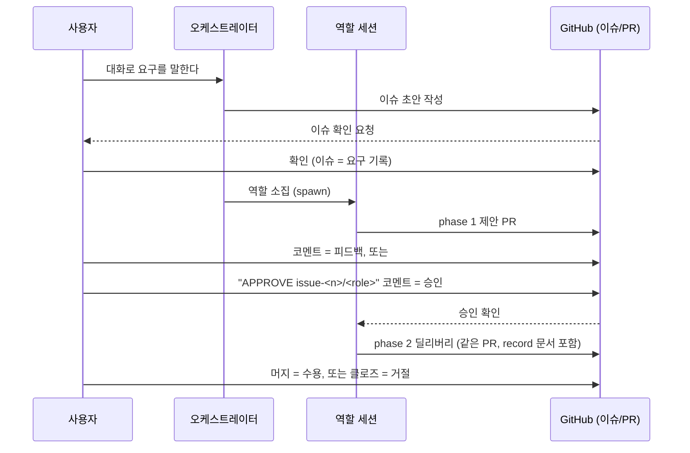
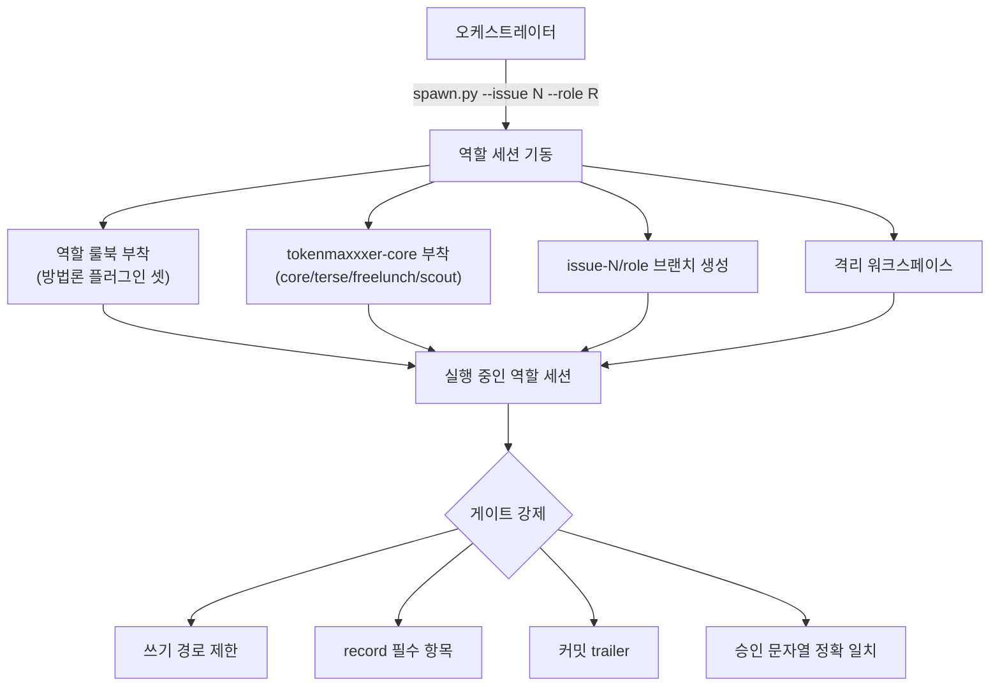

# tokenmaxxxer / on-the-record

*[English](README.md)*

## 빠른 시작

```
gh auth login
```

대화 세션 안에서:

```
/plugin marketplace add tokenmaxxxer/on-the-record
/plugin install on-the-record@tokenmaxxxer
/on-the-record:run
```

이게 전부다 — clone 도, 토큰도, 시크릿도 필요 없다. 자세한 요구사항과 선택
설정(에이전트 계정, 모델 고정, 프로젝트 초기화)은
[`docs/handbooks/setup.md`](docs/handbooks/setup.md)에 있다.

## 상호작용 흐름

설치한 뒤 실제로 무슨 일이 일어나는가 — 아래 에세이가 논증하는 것을 이 repo의
구체적인 물체(이슈, PR, 브랜치, record, 게이트)로 보여준다.

### 사용자 쪽에서 보이는 루프

사용자는 대화로 요구를 말한다. 오케스트레이터가 이슈 초안을 쓰고 사용자가
확인하면, 그때부터 사용자의 입력과 AI의 활동은 각자 정해진 자리에만
기록된다: 요구는 이슈, 결정은 승인 코멘트, 작업은 `issue-<n>/<role>` 브랜치의
PR, 근거는 그 PR의 record 문서. 역할은 phase 1(제안)을 먼저 내고, 사용자가
승인해야 phase 2(딜리버리)가 열린다. 사용자는 코멘트로 피드백을 주고,
`APPROVE issue-<n>/<role>` 코멘트로 승인하고, 머지로 수용하고, 클로즈로
거절한다.



### 스폰 · 룰북 · 코어 · 규약

오케스트레이터는 `spawn.py`로 역할 세션을 띄운다: 이슈 번호를 앵커로 삼아
`issue-<n>/<role>` 브랜치를 만들고, 격리된 워크스페이스를 연다. 그 세션에는
그 역할의 룰북(방법론 플러그인 셋)과 `tokenmaxxxer-core`의 공용 플러그인 넷
(core/terse/freelunch/scout)이 함께 붙는다. 세션 안에서는 여러 게이트가
contract v3의 핵심 규칙을 기계적으로 강제한다 — 쓰기 경로 제한, record 필수
항목, 커밋 trailer, 승인 문자열의 정확한 일치.



## 믿음이 필요 없는 협업 — tokenmaxxxer가 지향하는 이상향

### 이 글의 주장

AI 에이전트 시대의 이상적인 협업 형태는, 역설적이게도 **에이전트를 믿을 필요가
없는 협업**이다. 이 글은 그 이상향이 왜 타협이 아니라 도달점인지를 논증한다.

에이전트의 능력은 극대화하되, 그 능력을 믿어야만 성립하는 지점을 시스템에서
전부 제거한다. 믿음이 빠져나간 자리를 채우는 것이 기록(record)과 게이트(gate)다.

### 1. 문제: 유능하지만 믿을 수 없는 일꾼

LLM 에이전트는 역사상 처음 등장한, "유능함"과 "신뢰 가능함"이 분리된
일꾼이다. 인간 조직에서 이 둘은 대체로 함께 자란다 — 일을 잘하는 동료는
시간이 지나며 믿을 만한 동료가 된다. 에이전트는 다르다. 아무리 유능해져도
다음 네 가지는 구조적으로 개선되지 않는다.

1. **멈출 줄 모른다.** 스스로 "충분하다"를 판정할 오라클이 없다.
2. **자기 평가가 부풀려진다.** "완료했습니다"라는 보고와 실제 완료 사이의
   간극은 모델이 좋아져도 사라지지 않는다 — 자기 오류에 대한 맹점은
   자기 평가의 구조적 속성이기 때문이다.
3. **지시에 구속되지 않는다.** "절대 하지 마라"는 프롬프트는 확률을 낮출
   뿐 행동을 금지하지 못한다. 심지어 읽는 텍스트에 섞인 타인의 지시에도
   오염된다.
4. **기억이 세션과 함께 죽는다.** 어제 합의한 것을 오늘의 세션은 모른다.

지난 3년간 업계 전체가 이 네 가지에 각각 데였다. 자율 에이전트의 무한
루프가 ①을, "AI 소프트웨어 엔지니어"의 부풀려진 데모가 ②를, 코드 프리즈
중의 운영 DB 삭제와 프롬프트 주입 유출 사고가 ③을, 매 세션 처음부터
반복되는 온보딩이 ④를 증명했다. 그리고 업계는 매번 같은 방식으로
대응했다: **배신당한 믿음을 모델에게서 회수해서, 모델 밖의 구조에게
넘긴다.**

### 2. 원리: 회수한 믿음은 어디로 가는가

그런데 네 가지 실패를 다시 보면, 사실 하나의 실패다. 멈출 줄 모르는
것은 "충분한가"라는 **판단**을 모델 안에 두었기 때문이고, 완료 보고가
부풀려지는 것은 "잘했는가"라는 판단을 모델 안에 두었기 때문이고,
지시가 뚫리는 것은 "해도 되는가"라는 판단을 모델 안에 두었기 때문이다.
네 번 데인 것이 아니라, **판단을 집행자에게 맡긴다는 하나의 실수**를
네 군데서 반복한 것이다.

그렇다면 이관의 원리도 하나로 정리된다. 모델에게서 회수해야 하는 것은
일이 아니라 판단이고, 회수한 판단은 성질에 따라 두 곳으로 간다.

**기준이 필요한 판단은 인간에게 간다.** 무엇을 만들지, 만들어진 것이
충분한지 — 이 판단의 기준(오라클)은 인간의 머릿속에 있고, 움직이며,
모델의 학습 분포 밖에 있다. 기준을 쥔 자만이 채점할 수 있으므로 이
판단은 애초에 인간 말고는 맡을 자가 없었다.

**기준이 필요 없는 판단은 게이트에게 간다.** 승인 문자열이 정확히
일치하는가, 쓰기 경로가 허용 범위인가, 필수 항목이 존재하는가 — 이런
검사는 판단이 아니라 대조이므로 언어를 이해할 필요가 없다. 언어를
하지 않는다는 것이 게이트의 무능이 아니라 무기다: 텍스트를 해석해서
인가를 결정하는 자는 텍스트에 주입당하지만, 문자열 등가를 재는 자는
주입당할 표면이 없다.

이렇게 판단이 전부 빠져나가고 나면, 에이전트에게 남는 것은 순수한
**집행**이다. 그리고 이것이 이 구조의 반전이다 — 판단을 빼앗긴
에이전트는 축소되는 것이 아니라 자유로워진다. 스스로 검증할 의무도,
멈출 시점을 저울질할 부담도 없이, 최대 자율로 병렬로 싸게 생성하고
멈추면 된다.

남는 물음은 하나다. 인간이 판단을 맡으려면 판단할 **대상**이 물체로
존재해야 한다. 에이전트의 작업이 대화 속에 증발해 버리면 인간은 무엇을
보고 승인하고 무엇을 보고 거절하는가. 여기서 기록이 등장한다.

### 3. 기록: 믿음을 대체하는 물질

"에이전트가 한 일을 믿을 수 있는가"라는 질문은 잘못 놓인 질문이다.
올바른 질문은 "**믿지 않고도 일을 맡길 수 있는가**"다. 이 전환을 가능하게
하는 유일한 수단이 기록이다.

기록이 협업에서 수행하는 역할은 세 겹이다.

**첫째, 기록은 검증의 대상을 만든다.** 대화 로그는 검증할 수 없다 —
경계가 없고, 흘러가고, 에이전트의 자기 서사와 사실이 섞여 있다. 반면
PR은 검증 가능하다: diff가 "무엇이 변했는가"라는 사실을, record 문서가
"왜 그랬는가"라는 주장을 담고, 둘이 같은 자리에 나란히 있어 대조가
가능하다. 한 명의 인간이 수십 개의 병렬 에이전트 위에서 판단자 노릇을
하려면 검사 단위가 규격화되어야 한다.
기록이 없으면 검증층이 무너지고, 검증층이 무너지면 2장의 분리 전체가
무너진다.

**둘째, 기록은 주장과 사실을 분리한다.** "고쳤습니다"는 주장이다.
"고쳤고, 증거로 이 grep 출력과 이 테스트 로그를 record에 첨부한다"는
검사 가능한 진술이다. tokenmaxxxer가 record에 실측 증빙을 게이트로
요구하는 이유가 이것이다 — 기록을 남기는 것을 넘어, **남긴 기록이
실물과 일치함을 기록 안에서 증명**하게 만든다.

**셋째, 기록은 죽음을 무의미하게 만든다.** 세션은 반드시 죽는다 —
컨텍스트가 차서, 한도에 걸려서, 그냥 크래시로. 기억이 세션에 있는 한
세션의 죽음은 프로젝트의 퇴행이다. 기억이 레포에 있으면 세션은
소모품이 된다: 다음 세션이 이슈와 record를 읽고 이어받으면 그만이다.
나아가 기록은 시간을 가로질러 복리로 쌓인다. 폐기된 설계는 사인(死因)과
함께 결정문으로 남아 같은 막다른 길을 두 번 파지 않게 하고, 컨텍스트가
0인 낯선 에이전트가 레포만 읽고 전 과정을 재구성할 수 있는 조직은
자기 역사에서 배울 수 있다. 기록되지 않은 조직은 같은 실수를 세션마다
새로 한다.

그래서 기록은 산출물의 부산물이 아니다. **망각하고, 과장하고, 지시에
구속되지 않고, 수명이 짧은 일꾼과의 협업을 위한 유일한 형태의 물질적 기반**이다.

### 4. 이상향: 기록 위의 조직

이제 tokenmaxxxer가 지향하는 상을 그릴 수 있다.

수십 개의 전문 역할이 각자의 방법론 규율 아래 병렬로 일한다. 어떤
역할도 다른 역할과 직접 대화하지 않는다 — 모든 조율은 머지된 기록을
통해서만 흐른다. 이것은 답답한 제약이 아니라 오류 증폭의 차단이다:
에이전트는 동료의 잘못된 출력을 무비판적으로 전제로 삼는 존재이므로,
역할 사이에 인간의 판단(머지)이 끼어드는 만큼 오류의 전파 거리가
짧아진다.

인간은 단 한 명이어도 된다. 그가 하는 일은 셋뿐이다 — 원하는 것을
이슈로 말하고, 제안을 읽고 승인하고, 딜리버리를 읽고 수용한다. 그는
코드를 만지지 않지만 방관자가 아니다. 정확히 반대다: 집행에서
해방됨으로써 그는 순수한 판단자, 조직의 유일한 오라클이 된다.

이 상의 아름다움은 완고함이 아니라 **해방**에 있다는 점을 강조하고
싶다. 게이트와 기록이 신뢰 문제를 전담하기 때문에, 에이전트는 의심받는
일 없이 최대 자율로 질주할 수 있고, 인간은 판단에만 집중할 수 있다.
믿음이 필요 없는 구조가 역설적으로 가장 큰 자율을 허락한다.
울타리가 튼튼한 목장에서만 말을 전속력으로 풀어놓을 수 있는 것과 같다.

### 5. 반론에 답한다

**"모델이 충분히 좋아지면 이 장치들은 불필요해지지 않는가."**
아니다. 이 장치들이 상대하는 것은 모델의 능력 부족이 아니라 역할의
구조다. 자기 평가의 맹점은 평가자와 피평가자가 동일하다는 구조에서
나오고, 주입 취약성은 지시와 데이터가 같은 채널로 들어온다는 구조에서
나오고, 오라클의 부재는 기준이 인간의 머릿속에 있다는 사실에서 나온다.
모델이 좋아질수록 집행의 질은 올라가지만, 판단을 집행자에게 겸직시켜도
되는 날은 오지 않는다. 오히려 능력이 커질수록 오판의 반경도 커지므로
분리의 가치는 능력에 비례해 커진다.

**"이 절차가 속도를 죽이지 않는가."**
절차가 죽이는 것은 속도가 아니라 되돌림이다. 업계가 실측으로 배운
교훈이 정확히 이것이다 — 구조 없는 속도는 체감으로만 빠르다. 개발자들이
스스로 20% 빨라졌다고 믿는 동안 실측은 19% 느려졌음을 보여줬고, 구조
없이 생성된 코드의 절반가량이 보안 결함을 안고 있었다. 잘못된 방향으로
전속력으로 달린 거리는 전부 부채다. 2단계 승인이 지불하는 몇 분은,
잘못된 전제 위에 쌓일 뻔한 며칠을 아끼게 해준다. 그리고 병렬성이 남은 속도를 회수한다.

**"기록의 비용이 과하지 않은가."**
기록을 인간이 쓴다면 과하다. 그러나 여기서 기록을 쓰는 것은 토큰당 가격이
폭락 중인 에이전트다. 생성이 싸지는 세계에서 기록의 한계비용은 0으로
수렴하는 반면, 기록의 가치 — 검증 가능성, 세션 불사성, 복리로 쌓이는
조직 기억 — 는 프로젝트가 길어질수록 커진다. 비용은 떨어지고 가치는
오르는 자산에 투자하지 않을 이유는 없다.

### 6. 맺음: 오래된 미래

이 이상향의 개별 부품 중 새로 발명된 것은 하나도 없다. 이슈, PR,
리뷰, 머지, 결정 기록, 감사 — 전부 소프트웨어 조직과 인간 제도가
수십 년에 걸쳐 발전시킨 장치들이다.

tokenmaxxxer의 기여는 발명이 아니라 **철저함**이다.

> 에이전트의 능력은 빌리되 에이전트의 판단은 빌리지 않는다.
> 인간은 노동에서 벗어나 판단에 집중한다.
> 그리고 그 사이의 모든 것을, 기록이 지탱한다.

다른 AI는 기록 없이 비공식적으로 일한다. 우리의 AI는 기록 위에서 투명하게 일한다.

## 더 알아보기

- [`docs/handbooks/setup.md`](docs/handbooks/setup.md) — 요구사항, 설치, 계정/모델 설정.
- [`docs/handbooks/operations.md`](docs/handbooks/operations.md) — 명령, 루프, 격리 모델,
  실측된 함정, 게이트, 자체 점검.
- [`docs/handbooks/on-the-record.md`](docs/handbooks/on-the-record.md) — 오케스트레이션 모델,
  역할 표, `on-the-record/` 플러그인 자체의 훅 테스트.
