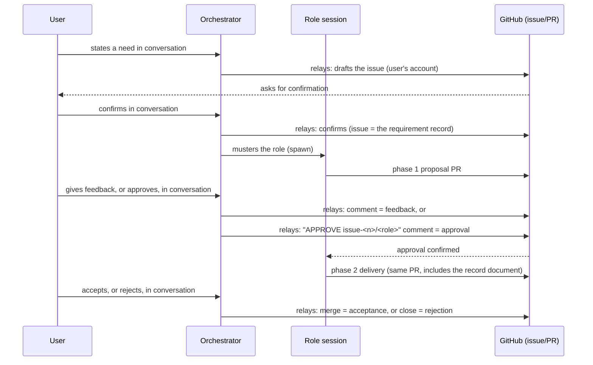
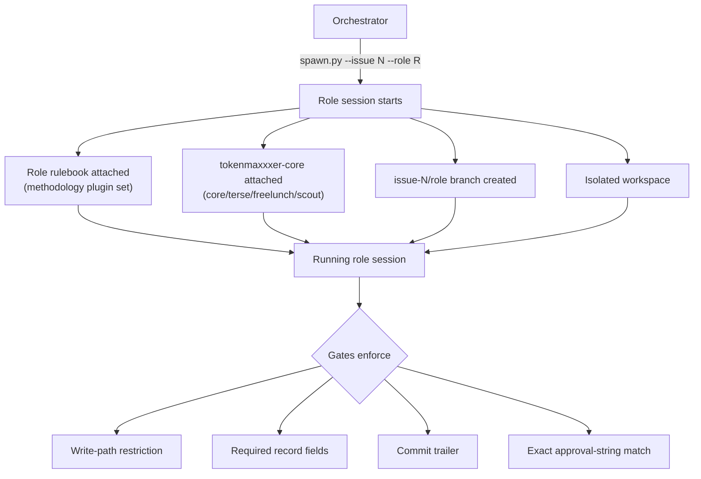

# tokenmaxxxer / on-the-record

*[한국어](README.ko.md)*

## Quickstart

```
gh auth login
```

In your conversational session:

```
/plugin marketplace add tokenmaxxxer/on-the-record
/plugin install on-the-record@tokenmaxxxer
/on-the-record:run
```

That's it — no clone, no token, no secret. Full requirements and optional
setup (agent account, model pinning, project init) live in
[`docs/handbooks/setup.md`](docs/handbooks/setup.md).

## Interaction flow

What actually happens after you install — grounding what the essay below
argues in this repo's concrete objects: issues, PRs, branches, records,
gates.

### The user-facing loop

The user states a need in conversation. The orchestrator drafts an issue
and relays it to GitHub under the user's account, the user confirms in
conversation, and from there the user's input and the AI's activity each
land in one fixed place: a requirement is an issue, a decision is an
approval comment, work is a PR on an `issue-<n>/<role>` branch, and the
rationale is that PR's record document. A role ships phase 1 (proposal)
first; phase 2 (delivery) opens only once the user approves. The user
never writes to GitHub directly — every decision is made in conversation
with the orchestrator, which relays it to GitHub under the user's
account: feedback as a comment, approval as an `APPROVE issue-<n>/<role>`
comment, acceptance as a merge, rejection as a close.



### Spawn, rulebook, core, protocol

The orchestrator brings up a role session with `spawn.py`: the issue
number anchors an `issue-<n>/<role>` branch and an isolated workspace.
That session gets that role's rulebook (its methodology plugin set)
plus `tokenmaxxxer-core`'s shared plugins (core/terse/freelunch/scout)
attached at spawn time. Inside the session, several gates mechanically
enforce contract v3's core rules — write-path restriction, required
record fields, the commit trailer, and exact approval-string matching.



## Collaboration that needs no trust — the ideal tokenmaxxxer aims at

### The claim

The ideal form of collaboration in the age of AI agents is, paradoxically,
**collaboration that requires no trust in the agent**. This essay argues
that ideal is a destination, not a compromise.

Maximize the agent's capability, but remove from the system every point
that only holds up if you trust that capability. What fills the space
trust leaves behind is record and gate.

### 1. The problem: a capable worker you cannot trust

The LLM agent is the first worker in history whose "capability" and
"trustworthiness" have come apart. In human organizations the two
usually grow together — a colleague who does good work becomes, over
time, a colleague you can trust. Agents are different. No matter how
capable they get, four things stay structurally unimproved:

1. **They don't know when to stop.** There is no oracle inside the agent
   that can rule "this is enough."
2. **Self-assessment inflates.** The gap between "done" and actually done
   does not shrink as the model improves — blindness to your own error is
   a structural property of self-assessment, not a capability gap.
3. **Instructions don't bind them.** A "never do this" in the prompt only
   lowers a probability; it cannot forbid an action. It can even be
   overridden by someone else's instructions mixed into the text it reads.
4. **Memory dies with the session.** Whatever was agreed yesterday, today's
   session does not know.

The industry got burned by each of these over the last three years.
Autonomous-agent infinite loops proved ①; the inflated demos of "AI
software engineers" proved ②; production-database deletions during code
freezes and prompt-injection leaks proved ③; onboarding repeated from
scratch every session proved ④. And every time, the industry responded
the same way: **pull the betrayed trust out of the model and hand it to
a structure outside the model.**

### 2. The principle: where the recovered trust goes

Look again at the four failures and they are actually one failure. The
agent doesn't know when to stop because the **judgment** of "is this
enough" was left inside the model; self-assessment inflates because the
judgment of "was this good" was left inside the model; instructions get
bypassed because the judgment of "is this allowed" was left inside the
model. It isn't four separate burns — it's **one mistake, letting the
executor hold judgment**, repeated in four places.

That gives a single principle for the handoff. What must be pulled out
of the model is not the work but the judgment, and the judgment, once
pulled out, goes to one of two places depending on its nature.

**Judgment that needs a standard goes to the human.** What to build, and
whether what got built is enough — the standard (the oracle) for this
judgment lives inside a human's head, moves, and sits outside the
model's training distribution. Only whoever holds the standard can grade
against it, so this judgment never had anywhere else to go.

**Judgment that needs no standard goes to the gate.** Does the approval
string match exactly, is the write path inside the allowed range, does a
required field exist — these are checks, not judgment, so they need no
understanding of language. Not understanding language is the gate's
weapon, not its limitation: whoever decides authorization by interpreting
text is exposed to injection through that text; whoever measures string
equality has no surface to inject into.

Once judgment has been fully pulled out this way, what's left for the
agent is pure **execution**. And this is the structure's reversal — an
agent stripped of judgment isn't diminished, it's freed. With no
obligation to self-verify and no burden of weighing when to stop, it can
generate at maximum autonomy, in parallel, cheaply, and simply stop when
told.

One question remains. For a human to hold judgment, there has to be a
physical **object** to judge. If the agent's work evaporates into a chat
transcript, what does the human look at to approve or reject? This is
where the record enters.

### 3. Record: the material that replaces trust

"Can you trust what the agent did" is the wrong question. The right
question is "**can you hand off the work without trusting it**." Record
is the only mechanism that makes that shift possible.

Record plays three layered roles in collaboration.

**First, record creates an object to verify.** A chat log cannot be
verified — it has no boundary, it drifts, and the agent's own narrative
is mixed in with the facts. A PR, by contrast, is verifiable: the diff
carries the fact of "what changed," the record document carries the
claim of "why," and the two sit side by side so they can be checked
against each other. For one human to act as judge over dozens of
parallel agents, the unit of inspection has to be standardized. Without
record, the verification layer collapses, and once it collapses the
whole separation in section 2 collapses with it.

**Second, record separates claim from fact.** "I fixed it" is a claim.
"I fixed it, and here is the grep output and the test log I'm attaching
to the record as evidence" is a checkable statement. This is why
tokenmaxxxer's gates require measured evidence in the record — beyond
just leaving a record, it makes the record **prove, inside itself, that
what it claims matches reality**.

**Third, record makes death irrelevant.** A session always dies —
context fills up, a limit is hit, or it just crashes. As long as memory
lives in the session, the session's death is the project's regression.
Once memory lives in the repo, the session becomes disposable: the next
session reads the issue and the record and picks up where it left off.
And record compounds across time. An abandoned design survives as a
decision document with its cause of death attached, so the same dead end
doesn't get dug twice, and an organization where a stranger agent with
zero context can reconstruct the whole history from the repo alone is an
organization that can learn from its own past. An organization with no
record makes the same mistake fresh, every session.

So record is not a byproduct of the output. It is **the only material
foundation possible for collaborating with a worker that forgets,
exaggerates, cannot be bound by instruction, and is short-lived**.

### 4. The ideal: an organization built on record

Now the picture tokenmaxxxer aims at can be drawn.

Dozens of specialized roles work in parallel, each under its own
methodology's discipline. No role talks directly to any other — all
coordination flows only through the merged record. This isn't a
frustrating constraint, it's a cutoff on error amplification: an agent
takes a peer's wrong output uncritically as a premise, so every point
where a human's judgment (a merge) sits between roles shortens how far
an error can propagate.

The human can be just one person. That person does exactly three things
— state what they want as an issue, read a proposal and approve it, read
a delivery and accept it. They never touch code, but they are not a
bystander. Exactly the opposite: freed from execution, they become the
pure judge, the organization's sole oracle.

I want to stress that the beauty of this picture is not rigidity but
**liberation**. Because gates and records handle the trust problem
entirely, the agent can run at maximum autonomy without ever being
doubted, and the human can focus purely on judgment. A structure that
needs no trust, paradoxically, permits the greatest autonomy — the same
way you can only let a horse run full speed inside a well-built fence.

### 5. Answering the objections

**"Won't these mechanisms become unnecessary once models get good
enough?"**
No. What these mechanisms address is not a shortfall in model capability
but the structure of the role. The blind spot in self-assessment comes
from the evaluator and the evaluated being the same entity; injection
vulnerability comes from instructions and data arriving through the same
channel; the absence of an oracle comes from the fact that the standard
lives inside a human's head. As models get better, the quality of
execution rises, but the day never comes when the executor can also hold
judgment. If anything, the radius of a wrong call grows with capability,
so the value of the separation grows in proportion to capability, not
away from it.

**"Doesn't this process kill speed?"**
What the process kills is not speed but reversal. This is exactly the
lesson the industry learned by measurement — speed without structure is
only fast in the moment. Developers believed themselves 20% faster while
measurement showed a 19% slowdown, and roughly half of code generated
without structure carried a security flaw. Every mile run at full speed
in the wrong direction is debt. The few minutes a two-stage approval
costs buy back the days that would have been built on a wrong premise.
And parallelism recovers the remaining speed.

**"Isn't the cost of record excessive?"**
It would be, if a human wrote it. But here the record is written by an
agent whose price per token keeps collapsing. In a world where
generation gets cheaper, the marginal cost of record converges to zero,
while record's value — verifiability, session-immortality, organizational
memory that compounds — grows the longer a project runs. There's no
reason not to invest in an asset whose cost falls while its value rises.

### 6. Closing: an old future

Not one individual part of this ideal is a new invention. Issues, PRs,
reviews, merges, decision records, audits — every one of them is a
device software organizations and human institutions developed over
decades.

tokenmaxxxer's contribution is not invention. It is **thoroughness**.

> Borrow the agent's capability, never its judgment.
> The human is freed from labor to focus on judgment.
> And the record holds up everything in between.

Other AI works off the record, informally. Ours works on the record,
transparently.

## Learn more

- [`docs/handbooks/setup.md`](docs/handbooks/setup.md) — requirements,
  installation, account/model configuration.
- [`docs/handbooks/operations.md`](docs/handbooks/operations.md) — commands,
  the loop, the isolation model, measured traps, gates, self-check.
- [`docs/handbooks/on-the-record.md`](docs/handbooks/on-the-record.md) — the
  orchestration model, the roles table, and the `on-the-record/` plugin's
  own hook tests.
