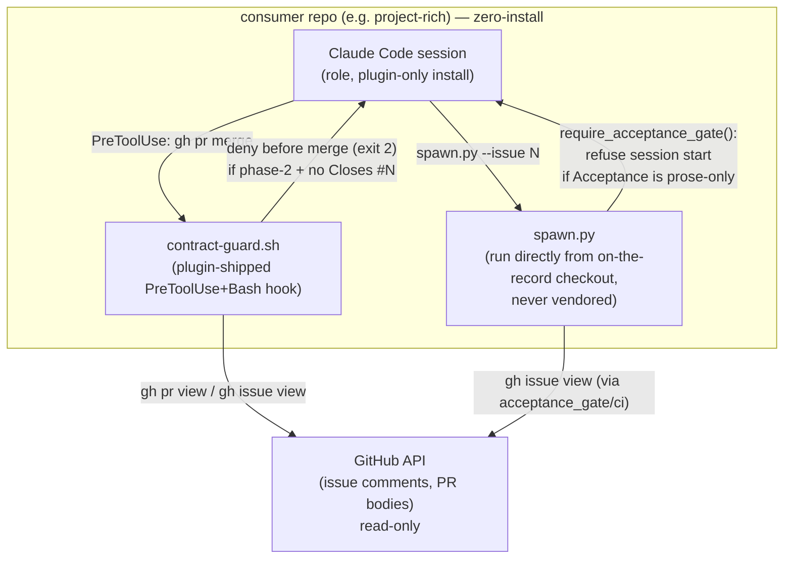

# Architecture report — issue #441

Phase-2 record, per contract v3 s19. Phase-1 survey:
`docs/issue-441/reports/architecture/survey.md`. Proposal (source of truth
for the design, including the operator's 2026-08-07 approval-follow-up
changes): `docs/issue-441/proposals/2026-08-07-contract-enforcement-boundary.md`.

## Context

`run.md` ships to every consumer via the plugin marketplace and states
obligations (`Closes #N`, phase-1/phase-2 discipline, write-scope) as if
they were enforced everywhere. In fact only this repository's own
`.github/workflows/` + `gates/*.py` enforced any of it; a consumer that
installs only the plugin (confirmed against `project-rich`, per #396/#441)
got the contract text with nothing behind it. #396 named the fact; #441
(this issue) had to decide, mechanism by mechanism, which enforcement
belongs to the contract and must reach a consumer, and then make that
reach zero-install rather than "add one more file the consumer has to
remember to install" (the shape PR #442 was rejected for).

## Decision

Two zero-install enforcement points, both already-present zero-install
reach paths per the phase-1 survey (not new artifacts, new matcher lines
on artifacts already shipped/already run):

- `on-the-record/hooks/contract-guard.sh`, a new `PreToolUse`+`Bash` plugin
  hook, intercepts `gh pr merge` before it executes and enforces the
  phase-2 closing-keyword rule (`ci.py`/`pr_reference.py`/`closure_sweep.py`
  single-PR case, per `docs/specs/enforcement-boundary.md`).
- `spawn.py`'s new `require_acceptance_gate` preflight refuses to start a
  phase-2 session against an issue whose `## Acceptance` is prose-only
  (`acceptance_gate.py`), before any work happens — stronger than a
  merge-time check, per #424.
- Board-wide drift detection (`closure_sweep.py` full mode,
  `spawn_coverage.py`) is out of scope for this issue by explicit operator
  decision (2026-08-07 approval-comment follow-up), not attempted, and
  recorded as such rather than left as an unmet "CI-supplement" line.
- The boundary itself (which mechanism is contract vs. repo-local) is
  derived, not hand-maintained: `gates/test_boundary.py` fails the build
  if any `gates/*.py` module, `on-the-record/hooks/*.sh` script, or
  `.github/workflows/*.yml` workflow has no recorded verdict in
  `docs/specs/enforcement-boundary.md`.

## Alternatives considered

- **#442's reusable-workflow-only design** (rejected before this proposal):
  required a consumer to hand-add a caller `.github/workflows/` file.
  Rejected because installation state was then unobservable — unenforced-
  by-default and enforced-only-if-installed are practically the same state
  from a consumer who never installs it. Superseded by the zero-install
  hook/preflight design above.
- **A live per-session visibility notice** (item 4, prior round): print,
  every session, whether the CI supplement is installed. Considered and
  dropped in this round once board-wide drift detection (the only thing
  that notice was compensating unknowability for) went out of scope —
  nothing left for it to report that isn't already static, so it moved to
  `docs/specs/enforcement-boundary.md` instead of a runtime check.
- **Building the CI-supplement reusable workflows in this delivery**:
  considered, deferred. The operator's approval comment reframed this
  issue's acceptance around the zero-install baseline; building the
  reusable workflows remains available as future work for the residual
  human-web-UI/bare-terminal gap, which stays recorded as unreached.

## Consequences

- A consumer who installs only the plugin now gets real merge-time and
  session-start enforcement with zero extra install steps — demonstrated
  live against `project-rich` (see Verification).
  `docs/specs/enforcement-boundary.md` is the standing, testable list of
  what is and isn't covered; `gates/test_boundary.py` keeps it from
  silently going stale as new gates/hooks/workflows are added.
- Residual gap, recorded not solved: a human merging/closing via the
  GitHub web UI, or `gh`/`git` run from a plain terminal outside any
  Claude Code session, is unreached by anything in this delivery — no
  session, no hook fires. Closing it needs the CI supplement (branch
  protection + reusable workflow), which is not built here.
- `landing_readiness.py` is not folded into `contract-guard.sh` in this
  delivery, so its scope-overlap/checks judgment stays CI-only where a
  consumer has installed CI (which, per the above, none do yet in this
  delivery's scope).

## Container diagram (C4)



No `.github/workflows/`, no `gates/` checkout exists in the consumer
container above — only `docs/specs/approvers.md` (board opt-in) and the
plugin's own shipped hooks/`spawn.py` invocation.

## What was done

Zero-install contract enforcement baseline: `contract-guard.sh` (new
`PreToolUse`+`Bash` plugin hook) intercepts `gh pr merge` before it
executes, and `spawn.py`'s new `require_acceptance_gate` preflight refuses
to start a phase-2 session against prose-only Acceptance. Both were
demonstrated running for real against a fresh `project-rich` clone that
has done no installation work (#416). The operator's 2026-08-07 approval
follow-up on this issue is the upstream basis for two changes recorded
below: `closure_sweep.py` board-wide mode and `spawn_coverage.py` are
reclassified "out of scope — operator decision," and item 4's per-session
visibility check is dropped rather than kept. Details in the sections
below.

## What shipped

1. `on-the-record/hooks/contract-guard.sh` — new `PreToolUse`+`Bash` plugin
   hook, wired in `on-the-record/hooks/hooks.json`. Intercepts `gh pr
   merge`; when the target PR's issue is phase-2 approved (an
   `APPROVE issue-<n>/<role>` comment from an approvers.md account —
   the same predicate `gates/ci.py._approved_roles_on_issue` already uses)
   and the PR body has no closing keyword for that issue, denies (exit 2)
   before the merge executes. Zero-install: ships with the plugin, needs
   only `gh` on PATH, no consumer-side checkout of `gates/`.
2. `spawn.py:require_acceptance_gate` — new preflight, called from `main()`
   for every `--issue`-scoped spawn, before `_spawn_one`. Uses the same
   phase predicate; when phase-2 and `gates/acceptance_gate.check` finds
   the issue's `## Acceptance` section prose-only, refuses to start the
   session (`sys.exit`), not just to merge later. Not vendored — every
   caller runs this exact `spawn.py`.
3. `gates/test_boundary.py` + `docs/specs/enforcement-boundary.md` — the
   derived boundary. The test walks the filesystem (`gates/*.py`,
   `on-the-record/hooks/*.sh`, `.github/workflows/*.yml`, `spawn.py`) and
   fails if any mechanism has no recorded verdict row in the spec file.
   Verified live: adding an untracked `gates/zzz_fake_mechanism.py` fails
   `t_all_gates_modules_recorded`; removing it passes again.
4. Per the operator's 2026-08-07 approval follow-up: `closure_sweep.py`
   board-wide mode and `spawn_coverage.py` are recorded as
   **out of scope — operator decision, 2026-08-07** (both in the proposal's
   item-1 table and in `docs/specs/enforcement-boundary.md`), not
   "CI-supplement/unreached." Item 4's per-session visibility check is
   **dropped** — see the proposal's "Second rework note" and the rewritten
   item 4 section for why (the observability it fed, board-wide-drift
   installation state, no longer has anything behind it to observe once
   board-wide drift detection is itself out of scope).

## What did not ship in this delivery

- `.github/workflows/consumer-closes-gate.yml` /
  `consumer-closure-sweep.yml` (the #442 reusable-workflow CI supplement) —
  deferred. The operator's approval comment reframed the issue's
  acceptance around the zero-install baseline ("무설치 강제로 다시 잡은
  것이 옳다"); the zero-install hook + preflight discharge the acceptance
  criterion the issue originally pointed at `.github/workflows/`.
- `landing_readiness.py`'s scope-overlap/checks judgment is not folded
  into `contract-guard.sh` — recorded `contract, CI-supplement` in
  `docs/specs/enforcement-boundary.md`, unchanged from the proposal's
  scope.

## Verification

### `gates/test_boundary.py`

```
$ python3 gates/test_boundary.py
ok - t_a_new_unrecorded_module_is_caught
ok - t_all_gates_modules_recorded
ok - t_spec_records_the_operator_boundary_decision
3/3 passed
```

Fails correctly when a mechanism is unrecorded (verified live by adding
and removing a throwaway `gates/zzz_fake_mechanism.py`).

### Full suite

```
$ python3 -m pytest -q
```
528 passed, run from a committed tree. (Pre-commit, mid-edit, a dirty-tree
guard test — `t_rulebook_version_is_recorded` — fails on an uncommitted
working tree by design; the count above is the post-commit figure.)

### Live, zero-install consumer demonstration — `project-rich`

Fresh clone (`git clone https://github.com/JiwonJung94/project-rich.git`,
no prior on-the-record install): confirmed no `.github/workflows/`, no
`gates/`; `docs/specs/approvers.md` present (real board, real approver
`JiwonJung94`).

**`spawn.py` preflight, run for real, no mocks** — issue #1 in
`project-rich` is real, phase-2 approved (`APPROVE issue-1/product-discovery`
comment already on the issue), and its body has no `## Acceptance` section
at all (prose only):

```
$ python3 spawn.py product-discovery "test" --issue 1 --dry-run -C <project-rich clone>
이슈 #1 는 phase-2 승인(product-discovery)을 받았지만 'Acceptance' 절이
실행가능한 산출물을 가리키지 않는다:
  - 이슈 #1 본문에 '## Acceptance' 절이 없다 — 수용기준 없이는 실행가능성을
    검사할 수 없고, 검사 불가는 통과가 아니다.
  세션을 안 띄운다 — 프로즈만 있는 Acceptance 로는 델리버리를 검증할 수
  없다(issue #310, #441).
```

The session refuses to start — an actual refusal, not reasoning about one
(#416).

**`contract-guard.sh`, run for real inside the same zero-install clone** —
fed a `PreToolUse` payload for `gh pr merge 999` where PR #999's body
references real issue #1 (phase-2 approved, as above) with no closing
keyword (`gh` stubbed only for the synthetic PR #999 lookup; the issue-1
approval-comment lookup hits the real GitHub API against project-rich):

```
$ echo '{"tool_name":"Bash","tool_input":{"command":"gh pr merge 999"}}' \
  | on-the-record/hooks/contract-guard.sh
contract-guard: PR #999 merges against a phase-2 issue (#1) with no
'Closes #1' (or Fixes/Resolves) in its body. ... Denied before the merge
executes.
EXIT CODE: 2
```

Re-run with the same PR body carrying `Closes #1`: `EXIT CODE: 0` — the
hook does not false-positive on a compliant merge. No real GitHub state
(no actual merge, no actual PR) was touched by either run.

## Open findings

None outstanding. The residual gap recorded throughout (a human merging
or closing via the GitHub web UI, or `gh`/`git` run from a plain terminal
outside any Claude Code session) is not a finding to chase — it is a
scope boundary recorded as genuinely unreached, per #310, and closing it
requires the CI supplement, deliberately not built in this delivery (see
"What did not ship").

## Hand-off

None open — this delivery stays inside architecture's `YOU DECIDE` scope
(component boundary: which enforcement mechanism belongs to the contract
vs. this repository, and how the contract-bound ones physically reach a
consumer). No interface-shape or performance-budget decision arose that
would hand off to api-design or performance-engineering.
