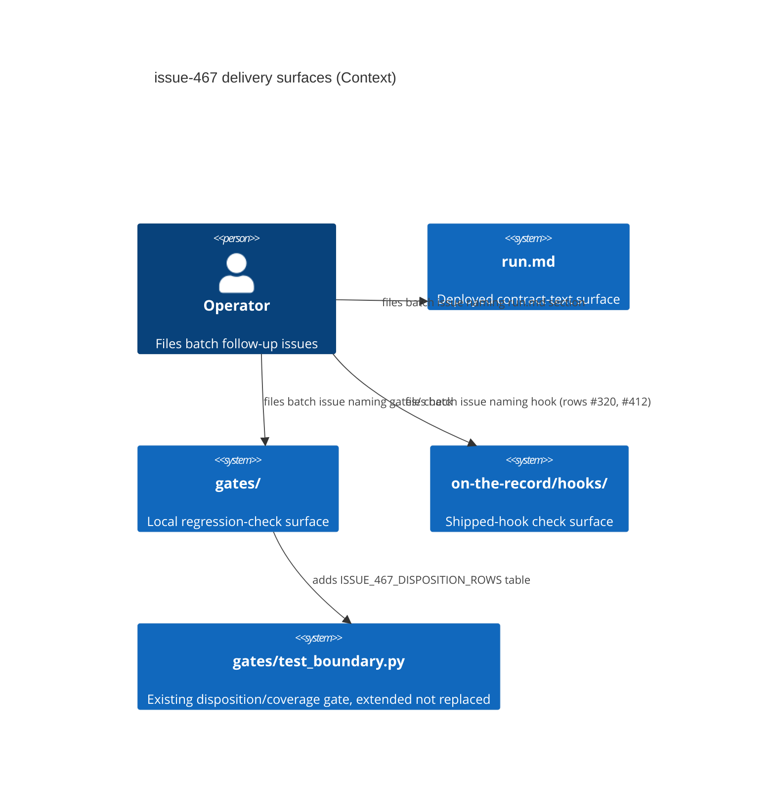

# issue-467 architecture report (phase 2)

Approved 2026-08-08 (single-account mode: `APPROVE issue-467/architecture`
by JiwonJung94, listed in `docs/specs/approvers.md`, matching PR #469's
author).

## What was done

Wrote the ADR
(`docs/issue-467/decisions/2026-08-08-per-row-delivery-and-batch-split.md`)
recording, per class-B row (#318, #320, #362, #363, #376, #377, #379,
#390, #412, #415, #416, #419, #424): the `run.md` contract-text location,
the named `gates/`-or-hook check, and which of 4 batches (A/B/C/D) it
belongs to; and the `gates/test_boundary.py` disposition-table check
plan (extends the existing file, per issue-457's precedent). No edits
outside the frozen write set — no `gates/**`, `on-the-record/commands/run.md`,
or `on-the-record/UNENFORCED-CLAUSES.md` changes in this issue.

## Why

issue-467 required, for the 13 issue-464-ADR class-B rows, a per-row
delivery mapping and a batch split into follow-up issues (13 rows exceed
one implementation session). The phase-1 proposal
(`docs/issue-467/proposals/2026-08-08-per-row-delivery-and-batch-split.md`,
approved) already fixed the mapping and split; phase 2 records that
content as the durable ADR per contract v3 s19.

Concrete upstream basis: issue-464 ADR's class-B disposition
(`docs/issue-464/decisions/...`), each row's own already-merged 2026-08-07
proposal (cited per-row in the ADR), and issue-457's precedent for adding
a table to `gates/test_boundary.py` (`GATE_PORTING_ISSUES`,
test_boundary.py:137-146) rather than replacing it.

## Context

13 `deployed-contract+check` rows from the issue-464 ADR each had design
merged with nothing built behind it. issue-467 asked architecture to map
each row to a concrete `run.md` location + named check, and to split the
13 rows into follow-up implementation issues sized one session each.

## Decision

Full per-row table and batch rationale live in the ADR (linked above);
summary: rows are grouped into 4 batches by shared gate surface —
**A** PR/merge-state integrity (#362, #390, #412), **B**
proposal-content-shape gates (#318, #363, #379), **C**
reporting/discoverability gates (#320, #376, #377), **D**
code/claim provenance and recurrence gates (#415, #416, #419, #424) — and
the first-landing batch also adds `gates/test_boundary.py`'s
`ISSUE_467_DISPOSITION_ROWS` table, extending (not replacing) that file.

## Consequences

Each follow-up issue is self-contained (fixed rows, fixed `run.md`
location, fixed check file per row); no row's design is redone; #318 and
#424 are flagged for the implementer to resolve concrete file naming
against cited material since their original proposals named none.

## Alternatives Considered

One follow-up issue for all 13 rows (rejected: exceeds one session);
batching by issue number instead of gate surface (rejected: scatters
edits to shared files `gates/gates.py`/`gates/ci.py` across batches);
re-designing #318/#424 now instead of flagging (rejected: out of scope,
design work already belongs to their own merged proposals).

## C4 context diagram

## Batch follow-up issues for the operator to file

Not filed by this session (operator action, per contract v3 s19 phase
split — matches issue-464's pattern). The ADR's "Follow-up issues to
file" section has the full content; summary:

1. **Batch A — PR/merge-state integrity**: #362, #390, #412. First
   batch landed must also add `gates/test_boundary.py`'s
   `t_class_b_disposition_rows_cited` + `ISSUE_467_DISPOSITION_ROWS`
   (13-row table), stated explicitly as extending, not replacing,
   `gates/test_boundary.py`.
2. **Batch B — proposal-content-shape gates**: #318, #363, #379.
3. **Batch C — reporting/discoverability gates**: #320, #376, #377.
4. **Batch D — code/claim provenance and recurrence gates**: #415,
   #416, #419, #424.

## Open findings

None. All 13 rows had a named check reachable from their own already-
merged proposal or PR design except #318 and #424, which named no
concrete file in their original proposal — flagged in the ADR as
implementer-resolves-against-cited-material, not an open finding against
this session's own work.

## Hand-off

Implementation role: build each batch's `run.md` contract text, named
check(s), and (whichever batch lands first) the `test_boundary.py`
disposition-table addition, one follow-up issue/session per batch, per
the ADR. Operator: file the 4 batch issues per the ADR's "Follow-up
issues to file" section.

loop_state: done
