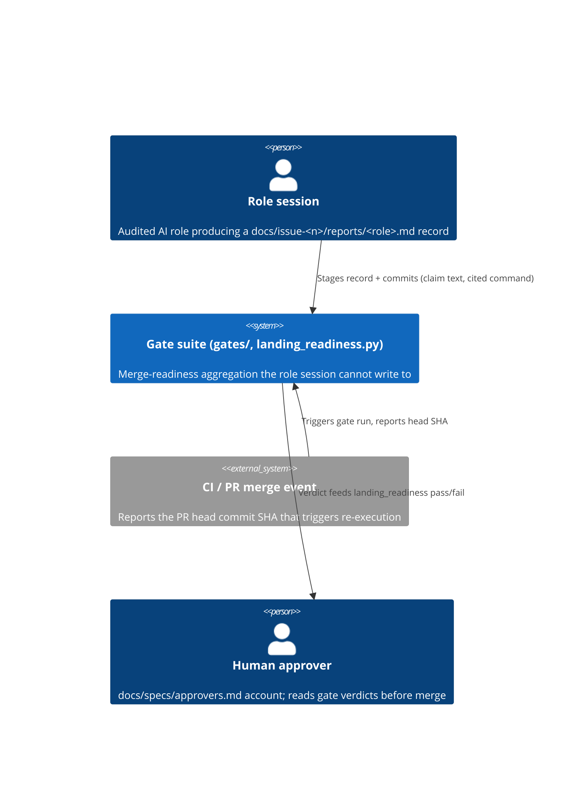
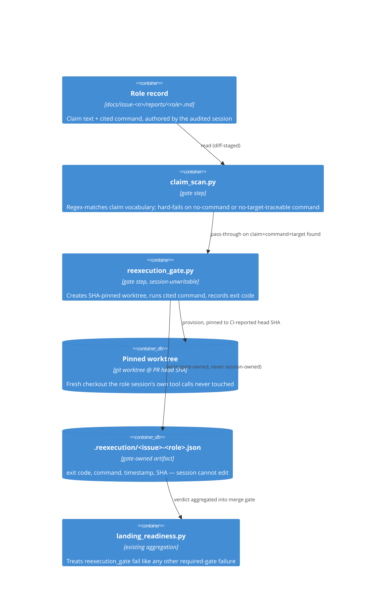

# C4 context/container — H1/H2 gate boundary (issue #476)

Companion diagram to [[2026-08-08-h1-h2-mechanism-adr]]. Scope: where the new
components sit relative to the existing role-session / gate-suite boundary
this repo already has (per survey: no gate executes anything today).

## Context

## Container — H1 re-execution path

## Boundary note

The only write edge into `.reexecution/*.json` originates inside
`reexecution_gate.py` itself, run as part of `landing_readiness.py`'s
aggregation — never as a commit the audited role session's own git history
contains. This is the diagrammed form of the incentive-independence argument
in the ADR: the box that produces the verdict and the box that is judged by
it are drawn as separate containers with no shared write path.
