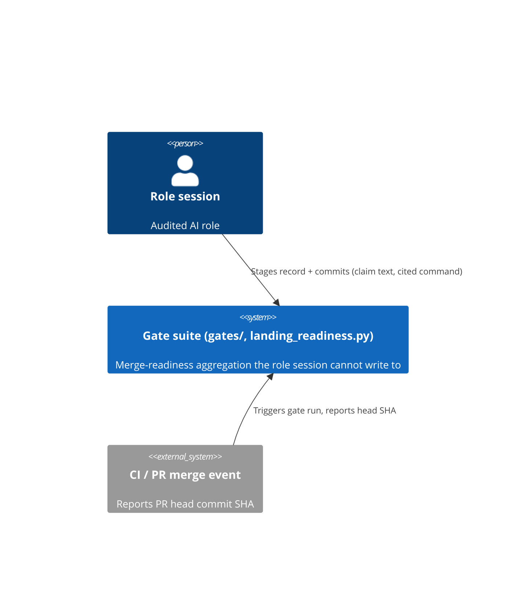

# architecture — issue #476, phase 2

## What was done

Recorded the ADR
([[2026-08-08-h1-h2-mechanism-adr]],
`docs/issue-476/decisions/2026-08-08-h1-h2-mechanism-adr.md`) and the
companion C4 context/container diagram
(`docs/issue-476/decisions/2026-08-08-c4-context-container.md`) per the
approved phase-1 proposal. Docs-only delivery — no code changes; this ADR
freezes the component boundary (`claim_scan.py` / `reexecution_gate.py` as
new gate-owned components with a session-unwritable verdict artifact, plus a
closed-vocabulary extension for H2) for step 3 implementation to build
against.

## Context

`docs/issue-476/proposals/discovery.md` pre-registered H1 (mechanized
independent re-execution) and H2 (refusal at equal structural cost). The
current-state survey found no gate in this repo executes anything today —
every check is text/structure over a record file — and that H2's
closed-vocabulary pattern already exists twice, needing only extension.

## Decision

Full decision text lives in
[[2026-08-08-h1-h2-mechanism-adr]]
(`docs/issue-476/decisions/2026-08-08-h1-h2-mechanism-adr.md`), summarized:
H1 adds `gates/claim_scan.py` (claim-vocabulary trigger, hard-fails a claim
with no adjacent command or no command-to-target traceability) and
`gates/reexecution_gate.py` (SHA-pinned worktree, gate-owned verdict at
`.reexecution/<issue>-<role>.json`, session-unwritable), aggregated by the
existing `landing_readiness.py`. H2 extends the existing `loop_state` closed
vocabulary with `refused`/`not-needed`/`cannot-verify`, checked at the same
field-presence strictness as a positive-path record.

## C4 boundary (context)

Full context/container diagram:
`docs/issue-476/decisions/2026-08-08-c4-context-container.md`.

## Consequences

New runtime capability enters the gate suite (subprocess execution in an
isolated checkout) — new surface area the existing text-only gates did not
carry. `landing_readiness.py` gains a dependency on git worktree creation
being available in the CI/hook environment; a consumer environment that
cannot create worktrees must fail closed, not silently skip. H2 adds only
enum/field-check extension, no new runtime dependency. Per the operator's
iterative-decision-rule addition, this ADR's mechanisms are not declared
done on delivery — step 4 measures the pre-registered metric and either
closes or returns to discovery.

## Alternatives Considered

Rejected: (1) LLM-based verifier subagent — still self-report shaped from
the ground-truth side; (2) standalone external CI service — fails the
zero-install/plugin-surface constraint; (3) session runs its own pre-submit
re-check — exactly the named failure signature discovery rules out; (4) a
separate `refusal_gate.py` for H2 — would itself be a new gate satisfiable
by performance, versus extending an already-checked enum. Full rationale in
the ADR.

## Why

Phase 2 opened via `APPROVE issue-476/architecture` (issue comment,
2026-08-08T10:03:21Z, JiwonJung94 — listed in `docs/specs/approvers.md`;
single-account mode, PR #483 author is the same account). Recording the
decision is this role's required phase-2 output (contract v3 s19); the ADR
and diagram are what step 3 (implementation, a separate issue-role) needs to
build the gate boundary without re-deriving it.

## Upstream / basis

- `docs/issue-476/proposals/architecture.md` (phase-1 proposal, approved)
- `docs/issue-476/reports/architecture/survey.md` (current-state survey)
- `docs/issue-476/proposals/discovery.md` (pre-registered H1/H2 hypotheses)
- `docs/reports/2026-08-08-hunt-architecture.md` (after-proposal warrant hunt;
  vacuous-command bypass, closed in the ADR's command-to-target traceability
  requirement)

## Current kind and loop_state

kind: decision-record
loop_state: closed

## Open findings

None new. Two risks are carried forward from the ADR as explicitly
unresolved (not findings against this record, but scope this record hands
off, not closes):

- The claim-vocabulary regex and the command-to-target traceability
  heuristic are both named in the ADR as living risks expected to need
  iteration once implementation exercises them against real records.
- H2's gaming-resistance is not architecturally provable — it is measured
  post-rollout against the pre-registered `refusal_rate ≤ 40%` guardrail
  in step 4 (execution-observation), per the operator's iterative-decision-
  rule addition (issue #476 comment, 2026-08-08T09:38:14Z): if the metric
  doesn't clear threshold, the work returns to discovery rather than being
  declared done.

## Hand-off

Interface shape detail (exact `claim_scan.py` regex, `reexecution_gate.py`
function signatures, `.reexecution/<issue>-<role>.json` schema) → step 3
implementation (separate issue-role, not this session). No performance
budget question arose in this phase — no hand-off to performance-engineering
needed.
