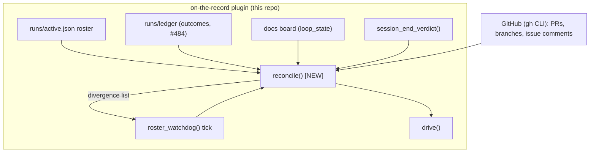

# ADR: reconciliation step for shipped session supervision (issue-492 step 1)

## Context

`spawn.py` already derives a session's own terminal state honestly
(`session_end_verdict` — normal/crashed/stalled/in-progress, #132) and
derives a git-grounded outcome from that (`fail_closed_downgrade`, #484,
covers SIGKILL-mid-run as `crashed`→ledger already). `roster_watchdog`
(#464) sweeps the whole roster on a repeating tick and `_auto_respawn_check`
(#488) already turns `crashed` into a bounded respawn. See
`docs/issue-492/reports/architecture/survey.md` for the full inventory.

What is missing, and what #492 actually asks for: nothing compares the
**expected** side (what the dispatched role/subject was asked to deliver —
branch advance, PR, `loop_state` transition) against the **observed** side
(roster/board/git/PR state, freshly re-read) and names, per divergence, a
next action. The orchestrator's continuation today is driven by trusting
`loop_state` directly (`drive()`, spawn.py:2502); #492 requires it be driven
by reconciled state instead. The scout brief's exemplar (Kubernetes
controller reconciliation: desired-state vs observed-state, level-driven,
re-derived every tick, never edge/report-triggered) names this exact shape
and confirms it's a known, idempotent, non-terminating pattern rather than a
one-off heuristic.

## Decision

Add one pure comparison function to `spawn.py`,
`reconcile(expected: dict, observed: dict) -> list[dict]`, and one CLI verb,
`spawn.py reconcile [--issue N]`, that:

1. Builds `expected` from what a roster/ledger entry itself recorded at
   dispatch time (subject, role, target branch, whether a PR was expected)
   — no new schema; this is data `roster_register`/`ledger_write` already
   have or need one field added to (e.g. `expects_pr: bool` at dispatch).
2. Builds `observed` from existing readers: `session_end_verdict` (session
   terminal state), `_pr_for_branch`/`_pr_open_or_merged_for_branch` (PR
   existence), `board()` (current `loop_state`), git HEAD delta (already
   computed by `_is_new_commit`/`board_snapshot`).
3. Diffs the two and returns divergences, each with a named next action
   drawn from a small closed set (`respawn`, `resume-watch`,
   `manual-review`, `none` — matching the issue's own worked example:
   "dies without pushing → respawn/resume").
4. Is called from inside `roster_watchdog`'s existing tick (spawn.py:1705)
   — reconciliation rides the same board-read cadence already running
   every 10-15 min, not a second poller. Riding that tick alone does not
   make `drive()` (spawn.py:2502) use it: `drive()` is a separate CLI verb
   that today reads board `loop_state` directly and would keep doing so
   unchanged unless it is itself edited to call `reconcile()`'s divergence
   list before falling back to `loop_state` — this is named explicitly as
   a required step-2 write-surface change (`spawn.py`'s `drive()` body,
   not just a new function beside it), not an incidental side effect of
   adding the reconcile tick.

This is additive: `session_end_verdict`/`fail_closed_downgrade` are the
observed-state inputs, unchanged. No daemon, no new process — same
injectable-pure-function + thin-CLI shape already used for
`gates/closure_sweep.py` and `gates/spawn_coverage.py` (see survey).

### C4 (container-boundary sketch)

## Consequences

- Orchestrator continuation stops trusting a session's own completion
  report as sufficient; it always re-derives from roster+board+PR+git state
  on the reconcile tick, closing the "trusting only the happy-path report"
  gap the issue names directly.
- Every terminal state (including SIGKILL/hang/vanish) already produces a
  durable observable event via `session_end_verdict`/ledger; reconcile adds
  the missing comparison, so the full acceptance chain (`kill -9` → distinct
  terminal event → reconciliation names divergence + next action) becomes
  testable end to end in `test/test_spawn.py`.
- `expects_pr` (or equivalent expected-outcome field) becomes new roster/
  ledger schema surface — a small, additive field, not a breaking change to
  either file's existing consumers.
- `gates/test_boundary.py` needs one manifest row per delivered piece per
  the issue's third acceptance check.

## Alternatives considered

1. **Fold divergence detection into `session_end_verdict` itself.**
   Rejected: that function's contract is single-session terminal-state
   classification with no board/PR access; conflating it with board-wide
   comparison breaks its existing pure-function tests and its call sites
   that don't have `expected` available.
2. **New daemon/poller for reconciliation.** Rejected: `roster_watchdog`
   already owns the repeating board-read cadence; a second poller doubles
   `gh` API load and reintroduces the race class #451 already closed
   (distinguishing "no event" from "channel vanished").
3. **Cross-repo scope.** The mechanism (comparison function + CLI verb) is
   entirely a plugin-surface change — ships with spawn.py, per the issue's
   own constraint. No core contract-text change is needed: contract v3 s19
   already treats `loop_state`/board as authoritative, and reconciliation
   is a stricter *reader* of that same board, not a new field or a new
   meaning for an existing one. No rulebook canon entry is needed either:
   no role directive changes, since reconciliation is orchestrator-side,
   not role-session-side. Per the #66 canon boundary, this is named here
   explicitly as a **no companion delivery** call, not silently assumed —
   if phase-2 implementation surfaces a genuine schema/contract need (e.g.
   `expects_pr` needing a core-level frontmatter contract change rather
   than a roster-only field), that becomes a companion issue at that point,
   not an in-scope surprise here.

## Out of scope (this step)

- Actual implementation of `reconcile()`/CLI verb/tests — step 2
  (implementation role), gated on phase-2 approval.
- `stalled` remains observe-only (#132's standing decision); this proposal
  does not reopen that.
- Execution-observation instrumentation (issue's step 3) — separate role.

## How this will be verified

Per the issue's own acceptance checks, to be implemented in step 2:
`test/test_spawn.py` red-green on (a) `kill -9` a running session process →
supervision reports a terminal state, not silence, and (b) a session that
dies without pushing → reconciliation output names the divergence and a
`respawn/resume` action; `gates/test_boundary.py` manifest rows for each
delivered piece.

## What did not work

(none yet — appended during phase-2 build if anything is undone or an
expectation fails to hold.)
