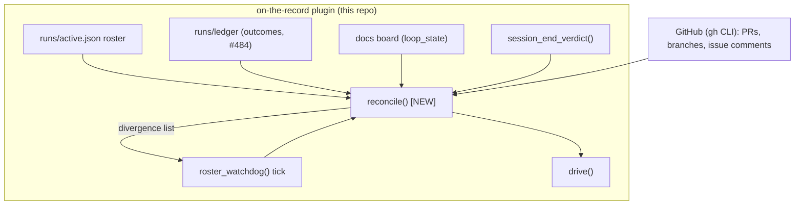

# issue-492 architecture report

Phase 2, per role-handoff contract v3 s19. Approved 2026-08-08
(`APPROVE issue-492/architecture`, single-account mode).

loop_state: done

## What was done

Wrote the ADR (`docs/issue-492/decisions/2026-08-08-reconciliation-step-for-supervision.md`)
recording the reconciliation-step design per the approved phase-1
proposal. This report restates that ADR's decision content at report
level and closes out step 1 (architecture). Docs-only: no code touched —
`reconcile()`, the CLI verb, `drive()`'s edit, and the tests are step-2
(implementation role) write surface per the proposal's own out-of-scope
section.

## Why / upstream basis

issue-492 asks for pipeline-level continuation to be reconciliation
(expected-vs-observed), not trust in a session's own completion report.
Upstream: `docs/issue-492/reports/architecture/survey.md` (current-state
inventory), `docs/issue-492/reports/architecture/scout-brief.md`
(Kubernetes-controller-reconciliation exemplar), and the approved
proposal `docs/issue-492/proposals/2026-08-08-shipped-session-supervision.md`.

## Context

`spawn.py` already derives a session's own terminal state honestly
(`session_end_verdict` — normal/crashed/stalled/in-progress, #132) and a
git-grounded outcome from that (`fail_closed_downgrade`, #484, covers
SIGKILL-mid-run as `crashed`→ledger already). `roster_watchdog` (#464)
sweeps the roster on a repeating tick; `_auto_respawn_check` (#488)
already turns `crashed` into a bounded respawn. Missing, and what #492
asks for: nothing compares the **expected** side (what the dispatched
role/subject was asked to deliver — branch advance, PR, `loop_state`
transition) against the **observed** side (roster/board/git/PR state,
freshly re-read) and names, per divergence, a next action. The
orchestrator's continuation today is driven by trusting `loop_state`
directly (`drive()`, spawn.py:2502). Full inventory:
`docs/issue-492/reports/architecture/survey.md`.

## Decision

Add one pure comparison function to `spawn.py`,
`reconcile(expected: dict, observed: dict) -> list[dict]`, and one CLI
verb, `spawn.py reconcile [--issue N]`:

1. `expected` comes from roster/ledger dispatch-time data (subject, role,
   target branch, `expects_pr` — new small additive field).
2. `observed` comes from existing readers: `session_end_verdict`,
   `_pr_for_branch`/`_pr_open_or_merged_for_branch`, `board()`, git HEAD
   delta (`_is_new_commit`/`board_snapshot`).
3. Diffs the two, returns divergences each with a next action from a
   closed set (`respawn`, `resume-watch`, `manual-review`, `none`).
4. Rides `roster_watchdog`'s existing tick (spawn.py:1705) — no second
   poller. `drive()` (spawn.py:2502) must itself be edited to consult
   `reconcile()`'s divergence list before falling back to raw
   `loop_state` — named explicitly as required step-2 write-surface, not
   incidental.

Full alternatives-considered detail: the ADR.

### C4 (container-boundary sketch)

This decision adds a call edge from `roster_watchdog()`'s existing tick
into a new pure `reconcile()` function, and from `reconcile()` into
`drive()`; it does not change the plugin's container boundary or add a
new container.

## Consequences

- Orchestrator continuation stops trusting a session's own completion
  report alone; it re-derives from roster+board+PR+git state every
  reconcile tick.
- `expects_pr` is new additive roster/ledger schema surface, not a
  breaking change.
- `gates/test_boundary.py` needs one manifest row per delivered piece
  (step-2 work).

## Alternatives considered

Folding divergence detection into `session_end_verdict` itself —
rejected, breaks that function's single-session pure-classification
contract. A second daemon/poller — rejected, `roster_watchdog` already
owns the board-read cadence and a second poller reintroduces the #451
race class. Cross-repo/core-contract scope — rejected: this is a
plugin-surface-only change, no core contract-text or rulebook canon
edit needed (named explicitly as a no-companion-delivery call per the
#66 canon boundary). Full detail: the ADR.

## Out of scope (this step)

`reconcile()`/CLI verb/tests implementation — step 2. `stalled` staying
observe-only is unchanged (#132). Execution-observation instrumentation
— issue's step 3, separate role.

## Open findings

None new. The after-proposal warrant hunt
(`docs/reports/2026-08-08-hunt-shipped-session-supervision.md`) named the
`drive()` edit explicitly as required step-2 write-surface (stance 4,
write-set-completeness) — folded into the ADR's Decision §4 above, not
left as a residual gap.

## Hand-off

Step 2 (implementation role): build `reconcile()`, the CLI verb, the
`drive()` edit, and `test/test_spawn.py`/`gates/test_boundary.py`
coverage, on a new branch per contract v3, gated on its own phase-1/
phase-2 approval cycle. Step 3 (execution-observation role) is out of
this role's scope entirely. Architecture's role in issue-492 step 1 ends
here.
